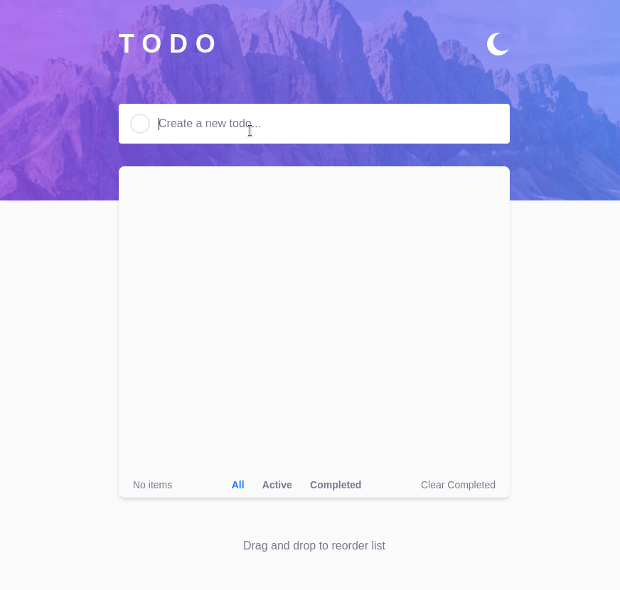

# Frontend Mentor - Todo app solution

This is a solution to the [Todo app challenge on Frontend Mentor](https://www.frontendmentor.io/challenges/todo-app-Su1_KokOW). Frontend Mentor challenges help you improve your coding skills by building realistic projects. 

## Table of contents

- [Overview](#overview)
  - [The challenge](#the-challenge)
  - [Solution Gif](#Solution-Gif)
  - [Links](#links)
- [My process](#my-process)
  - [Built with](#built-with)
  - [What I learned](#what-i-learned)
  - [Continued development](#continued-development)
- [Author](#author)
- [Acknowledgments](#acknowledgments)


## Overview

### The challenge

Users should be able to:

- View the optimal layout for the site depending on their device's screen size
- See hover states for all interactive elements on the page

### Solution Gif

<p align="center">
  
</p>


### Links

- Solution URL: [My Solution](https://github.com/Felipe-dot/next-todo-app)
- Live Site URL: [Live site](https://next-todo-app-rose-chi.vercel.app/)

## My process

### Built with

- NextJS
- TailwindCSS
- hello-pangea/dnd lib
- React Hooks
- Local Storage


### What I learned
I learn to use useEffect to avoid using multiple lines of repetitive code

```javascript
  useEffect(() => {
    if (todoList.length > 0) {
      localStorage.setItem("data", JSON.stringify(todoList));
    }
  }, [todoList]);
```

I use for the first time the dark theme mode on Tailwind Css

```html
 <div className="cursor-pointer bg-cover bg-center bg-[url('../images/icon-moon.svg')] dark:bg-[url('../images/icon-sun.svg')] h-7 w-7 sm:h-8 sm:w-8"></div>
```

### Continued development


I want to keep improving in

- NextJs
- TailwindCSS
- Responsive Layouts
- Web Technologies

## Author

- Website - [Felipe-dot](https://felipe-dev-portfolio.vercel.app/)
- Frontend Mentor - [@Felipe-dot](https://www.frontendmentor.io/profile/Felipe-dot)

